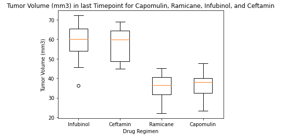
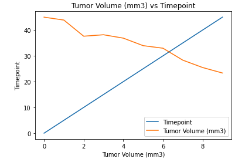
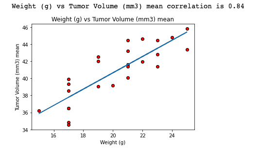

# Testing drug-regimens  

## Background

In this study, 249 mice identified with SCC tumor growth were treated through a variety of drug regimens. Over the course of 45 days, tumor development was observed and measured. The purpose of this study was to compare the performance of Pymaceuticals' drug of interest, Capomulin, versus the other treatment regimens. You have been tasked by the executive team to generate all of the tables and figures needed for the technical report of the study. The executive team also has asked for a top-level summary of the study results.

## Findings

Ramicane and Capomulin regimens had the most significant impact in decreasing the tumor volume (on average 35 mm3 and 38 mm3 respectively)

Considering all the drug regimens, the tumor volume decreased 95% on average within the forty timepoints.

Considering all the drug regimens, the correlation between the mice weight and the tumor volume is significant (.84); mice with more weight had a higher tumor volume

